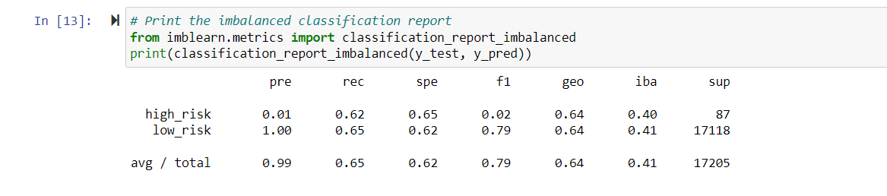
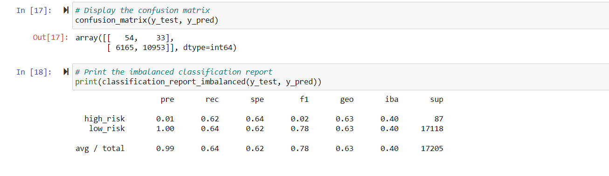
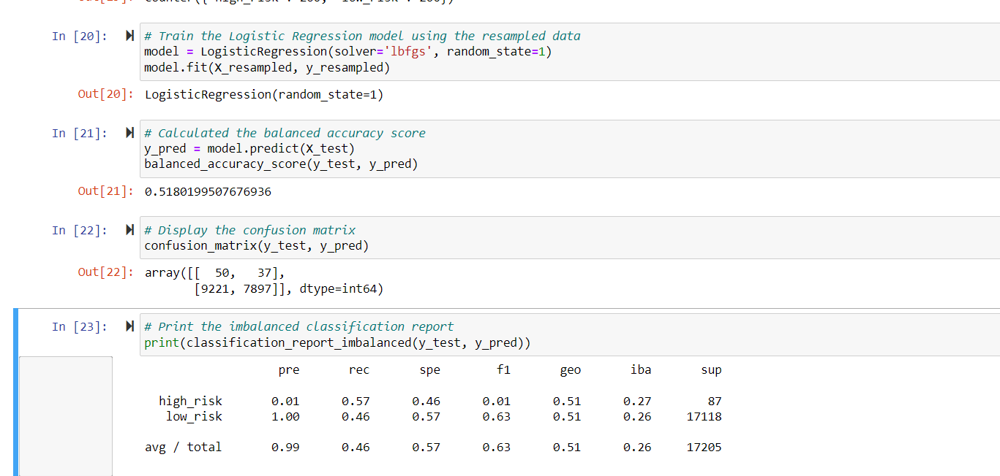
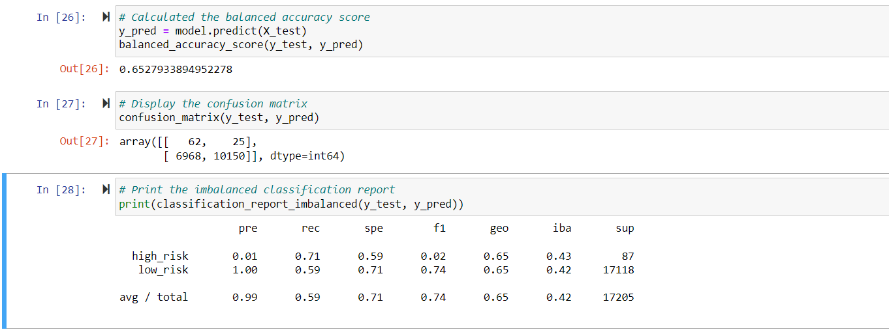
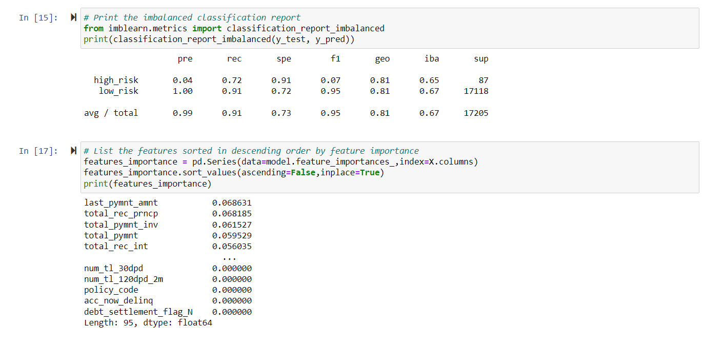
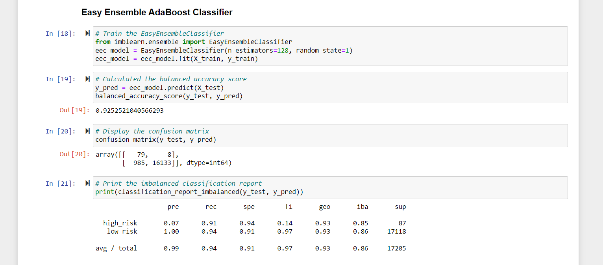

# Credit_Risk_Analysis
Supervised Machine Learning Module 17
## Overview of the analysis
This project is designed to analyze the data of peer to peer lending service company, Lending Club using credit card credit data set. Credit risk is crucial to identify for a company to avoid losses hence Jill and his team are analyzing the oversampling the data using RandomOver Sampler and SMOTE algorithms and undersampled using ClusterCentroids algorithm. Also we have used combination aprroach of SMOTEENN algorithm. For evaluting performance of the model, we have showed comparison between reduce bias, Balanced RandomForest classifier and Easy ensemble classifier. 

### Purpose of this analysis
- Use resampling model to predict credit risk. 
- SMOTEENN analysis to show combination approach to show comparison credit risk.
- Using Ensemble Classifier to predict risk. 

## Results of the analysis
Here are the results of balanced accuracy scores of all six machine learning models:
1. Naive Random Oversampling

This model predicts 61% outcomes for high credit risk with precision of this model 99% along with 68% sensitivity. Balanced accuracy score of this model is 64%. 

2. SMOTE model

Balanced accuracy score of SMOTE model is 59%, high risk precision 1% with sensitivity 61%. Due to high number of low_risk population, its precision with 99% and sensitivity 57%. 

3. Cluster Centroids Model

Balanced accuracy model score is 62%. Precision is 99% along with sensitivity 57%. 

4. SMOTEENN model

High risk precision of this model is 1% only with 70% sensitivity and precision 99%. Balanced accuracy score of SMOTEENN model is 63%. 

5. Balanced Random Forest Classifier

Balanced accuracy score of this model is 78% with precision 99% along with sensitivity of 87%. 

6. Easy Ensemble AdaBoost Classifier

Balanced accuracy score of this model is 93%. Hogh risk precision of this model is 9% with 79% sensitivity which makes F1 pf 16%. Precision is 99% with a sensitivity of 94%. 

## Summary
All these models that perform credit risk analysis show weak precision however EasyEnsemble model bring sensitivity of 92% of high risk credit. F1 score of the model for high risk credit has improved and this model detects 94% defaults to improve credit risk. Hence, i would recommend EasyEnsemble Classifier model for credit risk analysis to perform. 